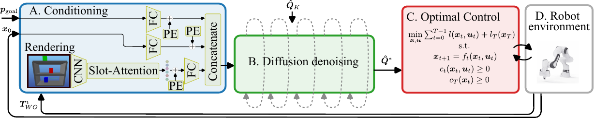
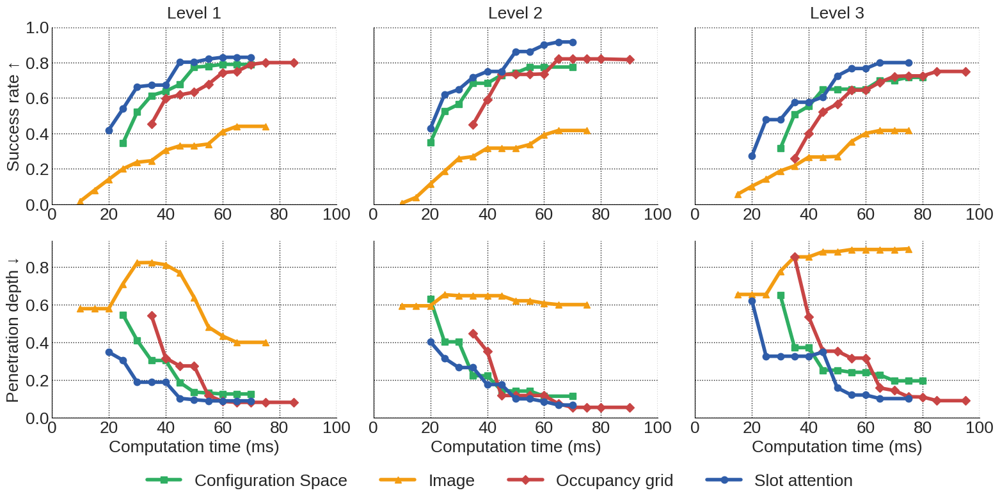
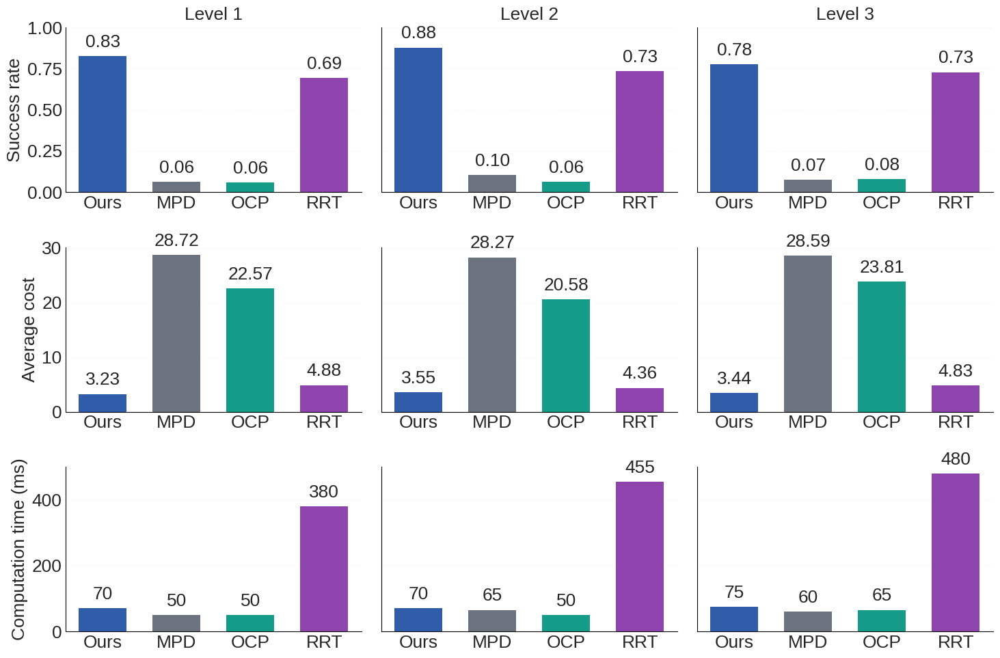

  <video
    controls
    autoplay
    loop
    muted
    playsinline
    preload="metadata"
    style="width:100%; height:auto; border-radius:8px; box-shadow:0 2px 8px rgba(0,0,0,0.15); background:#000;"
  >
    <source src="{{ '/static/RAL_2025.mp4' | relative_url }}" type="video/mp4">
    Your browser does not support the video tag.
  </video>

# Abstract

Acting in cluttered environments requires predicting and avoiding collisions while still achieving precise control. Conventional optimization-based controllers can enforce physical constraints, but they struggle to produce feasible solutions quickly when many obstacles are present. Diffusion models can generate diverse trajectories around obstacles, yet prior approaches lacked a general and efficient way to condition them on scene structure. In this paper, we show that combining diffusion-based warm-starting with a collision-aware model predictive controller (MPC) yields reliable and efficient motion generation under strict time limits. Our approach conditions a diffusion transformer on the system state, task, and surroundings, using an object-centric slot attention mechanism to provide a compact obstacle representation suitable for control. The sampled trajectories are refined by an optimal control problem that enforces rigid-body dynamics and signed-distance collision constraints, producing feasible motions in real time. On benchmark tasks, this hybrid method achieved markedly higher success rates and lower latency than sampling-based planners or either component alone. Real-robot experiments with a torque-controlled Panda confirm reliable and safe execution with MPC.

# Method

  
  

    Figure 1: Overview of our proposed architecture.
  

Our pipeline first encodes the scene and task, using Slot-Attention features from a rendered view plus the current state and goal, to build a compact conditioning vector. A conditional diffusion model denoises a noise sequence into a full trajectory prior, giving a warm-start that is close to feasible. This trajectory initializes an MPC solver that enforces robot dynamics and hard collision constraints, refining the motion to be executable. The resulting controls are applied on the robot, feedback updates the state, and the loop repeats.

# Results 

The benchmark environments are divided into three difficulty levels based on the number and placement of obstacles. Level 1 features a nearly free workspace with only a single randomly placed obstacle, making motion planning relatively easy. Level 2 introduces moderate clutter by placing one obstacle on each shelf level, increasing the need for careful collision avoidance. Level 3 represents the most challenging setting, with up to two obstacles per shelf level, resulting in highly constrained, non-convex environments that require precise and robust planning strategies.

  <video autoplay loop muted playsinline width="320" style="border-radius: 8px; box-shadow: 0 2px 8px rgba(0,0,0,0.2);">
    <source src="static/scene_1.mp4" type="video/mp4">
    Your browser does not support the video tag.
  </video>

  <video autoplay loop muted playsinline width="320" style="border-radius: 8px; box-shadow: 0 2px 8px rgba(0,0,0,0.2);">
    <source src="static/scene_2.mp4" type="video/mp4">
    Your browser does not support the video tag.
  </video>

  <video autoplay loop muted playsinline width="320" style="border-radius: 8px; box-shadow: 0 2px 8px rgba(0,0,0,0.2);">
    <source src="static/scene_3.mp4" type="video/mp4">
    Your browser does not support the video tag.
  </video>

## Comparison of the different conditioning methods

  
  

    Figure 2: Comparing the different conditioning methods.
  

Among the conditioning options, Slot Attention works best overall, giving the highest success at low to mid compute budgets and fast inference thanks to its compact object centric tokens. Occupancy grids come close but are heavier to build and slower at runtime, which hurts when you need quick replans. C space encodings from key configurations help in simple scenes, but they generalize less and require precomputing collision labels. Pure image based conditioning performs worst, it saturates early and misses geometric detail needed for reliable collision avoidance.

## Motion generation methods comparison

  
  

    Figure 3: Comparing the different motion generation methods.
  

Compared to existing baselines, our approach consistently achieves the highest success rates across all difficulty levels while maintaining low computation times. RRT performs well in simple environments but struggles in cluttered scenes and is significantly slower, making it unsuitable for real-time control. A pure OCP solver without warm-starts fails in most cases due to sensitivity to local minima. Motion Planning Diffusion (MPD) improves over OCP but lacks the dynamic feasibility guarantees provided by our integrated refinement. Overall, combining diffusion priors with OCP refinement yields smoother, safer, and more efficient trajectories, outperforming both classical and learning-based alternatives.

## Experiments on a real robot.

The experiments were done on a Franka Emika Panda manipulator.

### Exploring the workspace

  <video autoplay loop muted playsinline width="320" style="border-radius: 8px; box-shadow: 0 2px 8px rgba(0,0,0,0.2);">
    <source src="static/demo1.mp4" type="video/mp4">
    Your browser does not support the video tag.
  </video>

  <video autoplay loop muted playsinline width="320" style="border-radius: 8px; box-shadow: 0 2px 8px rgba(0,0,0,0.2);">
    <source src="static/demo2.mp4" type="video/mp4">
    Your browser does not support the video tag.
  </video>

  <video autoplay loop muted playsinline width="320" style="border-radius: 8px; box-shadow: 0 2px 8px rgba(0,0,0,0.2);">
    <source src="static/demo3.mp4" type="video/mp4">
    Your browser does not support the video tag.
  </video>

### Adapting the trajectory to avoid collisions

  <video autoplay loop muted playsinline width="320" style="border-radius: 8px; box-shadow: 0 2px 8px rgba(0,0,0,0.2);">
    <source src="static/blurred_exp_1.mp4" type="video/mp4">
    Your browser does not support the video tag.
  </video>

  <video autoplay loop muted playsinline width="320" style="border-radius: 8px; box-shadow: 0 2px 8px rgba(0,0,0,0.2);">
    <source src="static/blurred_exp_3.mp4" type="video/mp4">
    Your browser does not support the video tag.
  </video>
  

